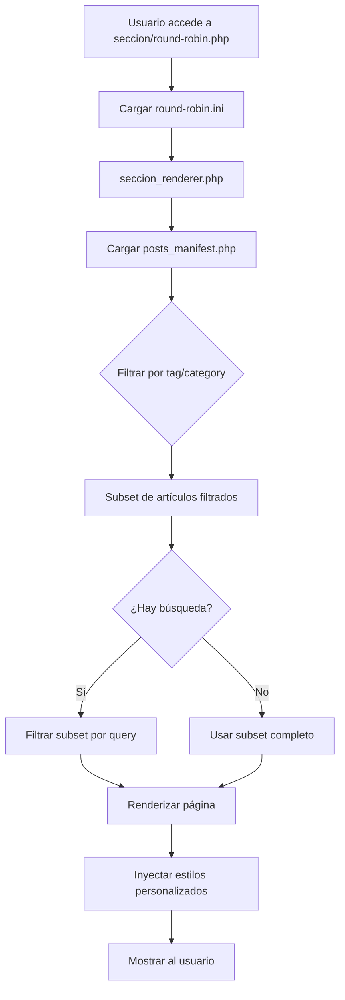

# Arquitectura Conceptual: Artículos Filtrados por Sección

## Objetivo

Crear un sistema de páginas temáticas que reutilicen la estructura visual de `lista_posts.php`, pero mostrando únicamente artículos filtrados por una etiqueta o categoría fija predefinida. Cada sección tendrá su propia configuración visual y de contenido mediante archivos `.ini`.

---

## Estructura de Directorios

```
web_EnDES/MBB_20251124_H/
├── seccion/
│   ├── round-robin.php          # Página de sección Round Robin
│   ├── serie-caribe.php          # Página de sección Serie del Caribe
│   ├── [otras-secciones].php     # Futuras secciones temáticas
│   └── ...
├── config/
│   ├── secciones/
│   │   ├── round-robin.ini       # Configuración de Round Robin
│   │   ├── serie-caribe.ini      # Configuración de Serie del Caribe
│   │   └── [otras-secciones].ini # Configuraciones futuras
│   └── sidebar_global.ini        # Configuración CENTRALIZADA del panel lateral
├── includes/
│   └── seccion_renderer.php      # Lógica compartida de renderizado
└── lista_posts.php               # Archivo histórico general (sin cambios)
```

---

## Formato del Archivo `.ini` de Configuración

Cada sección tendrá un archivo `.ini` en `config/secciones/` con la siguiente estructura:

```ini
[IDENTIDAD]
nombre = "Round Robin 2025-26"
slug = "round-robin"

[CABECERA]
titulo = "Round Robin LVBP 2025-26"
subtitulo = "Análisis, crónicas y estadísticas de la fase final de la temporada"
imagen_fondo = "assets/img/round-robin-bg.webp"

[FILTRO]
; Tipo de filtro: "tag" o "category"
tipo = "tag"
; Valor del filtro (nombre exacto de la etiqueta o categoría)
valor = "Round Robin 2025-26"

[ESTILO]
; Color principal de la sección (para títulos, enlaces, etc.)
color_primario = "#004c99"
; Color secundario (para hover, badges, etc.)
color_secundario = "#0066cc"

[PANEL_LATERAL]
; Título del panel lateral
titulo = "Otras Secciones"
; NOTA: Los enlaces ahora se cargan desde un archivo centralizado (config/sidebar_global.ini)
; No se definen enlaces aquí para mantener consistencia global

[SEO]
meta_description = "Cobertura completa del Round Robin de la LVBP 2025-26"
meta_keywords = "round robin, LVBP, béisbol venezolano, playoffs"
og_image = "assets/img/round-robin-og.webp"
```

---

## Configuración Centralizada del Panel Lateral (`config/sidebar_global.ini`)

Para facilitar el mantenimiento y asegurar que todas las secciones muestren las mismas opciones de navegación, los enlaces del panel lateral se definen en un único archivo compartido:

```ini
[GLOBAL]
titulo_defecto = "Otras Secciones"

[ENLACES]
; Define el orden y destino de los enlaces que aparecerán en todas las secciones
enlace[] = "Serie del Caribe 2026|seccion/serie-caribe.php"
enlace[] = "Round Robin 2025-26|seccion/round-robin.php"
enlace[] = "Todos los Artículos|lista_posts.php"
enlace[] = "Inicio|index.php"
```

---

## Arquitectura de Componentes

### 1. Archivo de Sección (`seccion/round-robin.php`)

Cada archivo de sección será **mínimo y declarativo**, delegando toda la lógica al renderer compartido:

```php
<?php
// seccion/round-robin.php
require_once '../config.php';
require_once '../includes/seccion_renderer.php';

// Cargar configuración de esta sección
$seccion_config = parse_ini_file('../config/secciones/round-robin.ini', true);

// Renderizar la página usando el renderer compartido
render_seccion($seccion_config);
?>
```

**Ventajas**:
- Cada nueva sección requiere solo 6 líneas de código PHP
- Toda la lógica está centralizada en `seccion_renderer.php`
- Fácil de mantener y escalar

---

### 2. Renderer Compartido (`includes/seccion_renderer.php`)

Este archivo contendrá toda la lógica de:
- Lectura y validación de la configuración `.ini`
- Filtrado de artículos desde `posts_manifest.php`
- Aplicación de búsqueda dentro del subset filtrado
- Renderizado de la cabecera personalizada
- Construcción del panel lateral con enlaces a otras secciones
- Inyección de estilos personalizados (colores)

**Funciones principales**:

```php
function render_seccion($config) {
    // 1. Validar configuración
    // 2. Cargar posts_manifest.php
    // 3. Filtrar artículos según config[FILTRO]
    // 4. Aplicar búsqueda si existe parámetro GET
    // 5. Renderizar header con config[CABECERA]
    // 6. Renderizar listado de artículos
    // 7. Cargar sidebar_global.ini y renderizar panel lateral
    // 8. Inyectar CSS personalizado con config[ESTILO]
}

function filtrar_articulos($posts, $tipo_filtro, $valor_filtro) {
    // Filtrar por tag o category según configuración
}

function aplicar_busqueda($posts, $query) {
    // Buscar solo dentro del subset ya filtrado
}

function render_panel_lateral($config_seccion) {
    // 1. Cargar config/sidebar_global.ini
    // 2. Usar título de la sección si existe, o el global por defecto
    // 3. Construir HTML con los enlaces globales
}
```

---

## Flujo de Datos



---

## Comparación: `lista_posts.php` vs Secciones

| Aspecto | `lista_posts.php` | Secciones (`seccion/*.php`) |
|---------|-------------------|----------------------------|
| **Artículos mostrados** | Todos los artículos | Solo artículos con tag/categoría específica |
| **Cabecera** | Fija: "Todos los artículos..." | Personalizable vía `.ini` |
| **Panel lateral** | Archivo por meses + Categorías globales | Enlaces a otras secciones (configurables) |
| **Búsqueda** | En todos los artículos | Solo en artículos de la sección |
| **Estilos** | Colores globales del sitio | Colores personalizados por sección |
| **Configuración** | Hardcodeada en PHP | Archivo `.ini` externo |

---

## Reutilización de Código

### Código compartido con `lista_posts.php`
- **Header HTML**: `header_lista_post.php` (ya existe)
- **Footer**: `footer.php` (ya existe)
- **CSS base**: `css/styles.css` (ya existe)
- **Manifest**: `posts_manifest.php` (ya existe)

### Código nuevo específico de secciones
- `includes/seccion_renderer.php`: Lógica de filtrado y renderizado
- `config/secciones/*.ini`: Configuraciones por sección
- `seccion/*.php`: Archivos de entrada mínimos

---

## Ejemplo de Uso: Crear Nueva Sección

### Paso 1: Crear archivo de configuración
`config/secciones/serie-caribe.ini`:
```ini
[IDENTIDAD]
nombre = "Serie del Caribe 2026"
slug = "serie-caribe"

[CABECERA]
titulo = "Serie del Caribe 2026"
subtitulo = "Cuando la política ganó por forfeit en Venezuela"
imagen_fondo = "assets/img/serie-caribe-bg.webp"

[FILTRO]
tipo = "tag"
valor = "Serie del Caribe 2026"

[ESTILO]
color_primario = "#c41e3a"
color_secundario = "#ff4444"

[PANEL_LATERAL]
titulo = "Otras Secciones"
enlaces[] = "Round Robin 2025-26|seccion/round-robin.php"
enlaces[] = "Todos los Artículos|lista_posts.php"
```

### Paso 2: Crear archivo de sección
`seccion/serie-caribe.php`:
```php
<?php
require_once '../config.php';
require_once '../includes/seccion_renderer.php';
$seccion_config = parse_ini_file('../config/secciones/serie-caribe.ini', true);
render_seccion($seccion_config);
?>
```

**¡Listo!** La nueva sección está operativa.

---

## Ventajas de esta Arquitectura

1. **Escalabilidad**: Crear una nueva sección requiere solo 2 archivos (`.ini` + `.php` de 6 líneas)
2. **Mantenibilidad**: Toda la lógica está en un solo lugar (`seccion_renderer.php`)
3. **Flexibilidad**: Cada sección puede tener colores, títulos y enlaces únicos
4. **Consistencia**: Todas las secciones comparten la misma estructura visual
5. **Sin duplicación**: Reutiliza componentes existentes (`header_lista_post.php`, `footer.php`)
6. **Configuración declarativa**: Los `.ini` son fáciles de editar sin tocar código PHP

---

## Consideraciones Técnicas

### Validación de Configuración
El `seccion_renderer.php` debe validar:
- Que el archivo `.ini` exista y sea válido
- Que los campos obligatorios estén presentes
- Que el tipo de filtro sea `tag` o `category`
- Que el valor del filtro exista en el manifest

### Manejo de Errores
Si falta configuración o el filtro no devuelve artículos:
- Mostrar mensaje amigable: "No hay artículos en esta sección"
- Ofrecer enlace a "Todos los artículos"
- Registrar error en log (opcional)

### Performance
- Cachear el resultado del filtrado si el manifest es muy grande
- Considerar generar páginas estáticas si el contenido cambia poco

### SEO
- Cada sección debe tener su propio `<title>`, `meta description` y Open Graph tags
- URLs amigables: `seccion/round-robin` (sin `.php` mediante `.htaccess`)

---

## Próximos Pasos de Implementación

1. **Crear `includes/seccion_renderer.php`** con funciones de filtrado y renderizado
2. **Crear directorio `config/secciones/`**
3. **Crear archivo `.ini` de ejemplo** (`round-robin.ini`)
4. **Crear directorio `seccion/`**
5. **Crear página de prueba** (`seccion/round-robin.php`)
6. **Probar filtrado, búsqueda y panel lateral**
7. **Ajustar estilos CSS** para colores personalizados
8. **Documentar proceso de creación de nuevas secciones**

---

## Notas Finales

Esta arquitectura permite que el blog crezca orgánicamente con nuevas secciones temáticas sin necesidad de modificar código existente. Cada sección es autónoma pero comparte la infraestructura común, garantizando consistencia visual y facilidad de mantenimiento.
